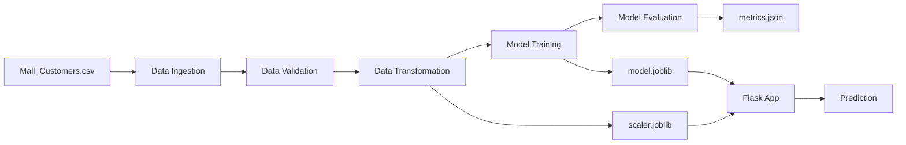

# Customer Segmentation — ML Pipeline 🎯

An end-to-end Machine Learning pipeline for customer segmentation using **K-Means Clustering**. This project identifies five distinct customer segments based on annual income and spending behavior, enabling data-driven marketing strategies.

## Problem Statement

Retail businesses need to understand their customer base to develop targeted marketing campaigns. This project segments mall customers into five actionable groups using unsupervised learning, providing specific marketing strategies for each segment.

## Key Features

- **5-Stage ML Pipeline**: Data Ingestion → Validation → Transformation → Training → Evaluation
- **StandardScaler Preprocessing**: Proper feature scaling for distance-based clustering
- **Configurable via YAML**: All hyperparameters and paths managed through config files
- **Flask Web App**: Premium UI for real-time customer segment prediction
- **Docker Support**: Containerized for easy deployment
- **One-Click Deployment**: Ready for Render (free tier)

## Architecture



## Pipeline Stages

| Stage | Component | Description |
|-------|-----------|-------------|
| 1. Data Ingestion | `DataIngestion` | Copies raw CSV to artifacts directory |
| 2. Data Validation | `DataValidation` | Validates column names against schema |
| 3. Data Transformation | `DataTransformation` | Applies StandardScaler to features |
| 4. Model Training | `ModelTrainer` | Trains KMeans (k=5) on scaled features |
| 5. Model Evaluation | `ModelEvaluation` | Computes silhouette, calinski-harabasz, inertia |

## Customer Segments

| Segment | Description | Strategy |
|---------|-------------|----------|
| 🛡️ Careful | Low Income, Low Spending | Budget-friendly products, discounts |
| 📊 Standard | Moderate Income, Moderate Spending | Balanced product range, loyalty programs |
| ⭐ Target | High Income, High Spending | Premium products, VIP services |
| 💳 Careless | Low Income, High Spending | Installment plans, credit options |
| 🧠 Sensible | High Income, Low Spending | Quality emphasis, investment products |

## Tech Stack

- **Python 3.10+**, scikit-learn, pandas, numpy
- **Flask** (web framework), Jinja2 (templates)
- **Docker** for containerization
- **Render** for deployment

## Dataset

The **Mall Customers** dataset contains 200 records with 5 features:

| Feature | Type | Description |
|---------|------|-------------|
| CustomerID | int | Unique identifier |
| Gender | object | Male/Female |
| Age | int | Customer age (18–70) |
| Annual Income (k$) | int | Income in thousands (15–137) |
| Spending Score (1-100) | int | Mall-assigned spending score |

Only **Annual Income** and **Spending Score** are used for clustering.

## Project Structure

```
MLCustomerSegmentation/
├── app.py                      # Flask web application
├── main.py                     # Pipeline orchestrator
├── setup.py                    # Package setup
├── Dockerfile                  # Docker configuration
├── render.yaml                 # Render deployment config
├── requirements.txt            # Dependencies
├── params.yaml                 # KMeans hyperparameters
├── schema.yaml                 # Data schema
├── config/
│   └── config.yaml             # Pipeline configuration
├── data/
│   └── Mall_Customers.csv      # Raw dataset
├── src/
│   └── customerSegmentation/
│       ├── __init__.py          # Logger setup
│       ├── constants/           # Path constants
│       ├── entity/              # Dataclass configs
│       ├── config/              # ConfigurationManager
│       ├── utils/               # Utility functions
│       ├── components/          # Pipeline components
│       └── pipeline/            # Prediction pipeline
├── templates/                   # HTML templates
├── static/                      # CSS assets
└── artifacts/                   # Generated pipeline outputs
```

## Getting Started

### Prerequisites

- Python 3.10+
- pip

### Local Setup

```bash
# Clone the repository
git clone https://github.com/thegreatone9/MLCustomerSegmentation.git
cd MLCustomerSegmentation

# Create virtual environment
python -m venv venv
source venv/bin/activate  # On Windows: venv\Scripts\activate

# Install dependencies
pip install -r requirements.txt

# Run the training pipeline
python main.py

# Start the web app
python app.py
```

The app will be available at `http://localhost:8080`

### Docker

```bash
# Build the image
docker build -t customer-segmentation .

# Run the container
docker run -p 8080:8080 customer-segmentation
```

## API Endpoints

| Route | Method | Description |
|-------|--------|-------------|
| `/` | GET | Landing page with prediction form |
| `/train` | GET | Trigger full training pipeline |
| `/predict` | POST | Predict customer segment |
| `/metrics` | GET | Return evaluation metrics (JSON) |

### Example Prediction Request

```bash
curl -X POST http://localhost:8080/predict \
  -d "annual_income=60&spending_score=75"
```

## Deployment (Render — Free)

1. Push code to GitHub
2. Go to [render.com](https://render.com) and create a new Web Service
3. Connect your GitHub repository
4. Select **Docker** as the environment
5. Deploy — Render will build and serve automatically

## Configuration

### `params.yaml` — Model Hyperparameters

```yaml
KMeans:
  n_clusters: 5
  init: k-means++
  n_init: 10
  max_iter: 300
  random_state: 42
```

### `config/config.yaml` — Pipeline Paths

All artifact paths and data sources are configured here. Modify to change data sources or output locations.

### `schema.yaml` — Data Schema

Defines expected column names and types for validation.
